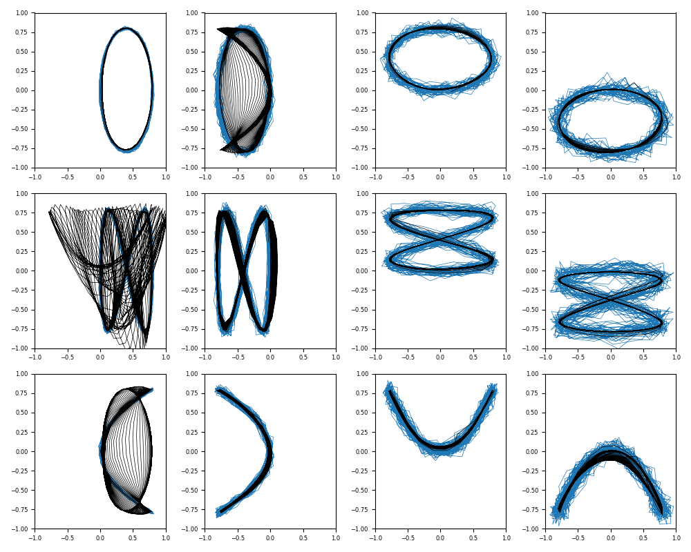
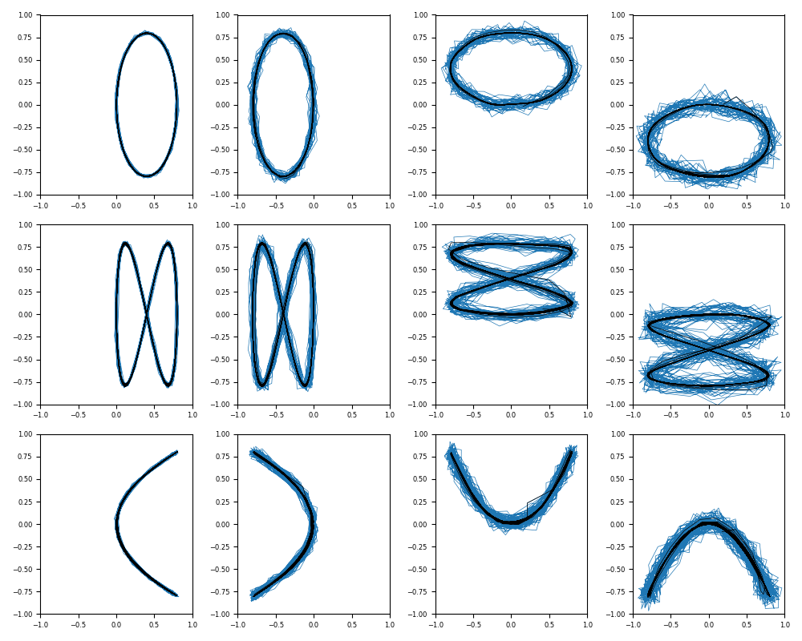

# StochasticRNN

 

Pytorch implementation of StochasticRNN, and the numerical experiments.

Paper: S. Murata, J. Namikawa, H. Arie, S. Sugano and J. Tani, ["Learning to Reproduce Fluctuating Time Series by Inferring Their Time-Dependent Stochastic Properties: Application in Robot Learning Via Tutoring"](https://www.cs.swarthmore.edu/~meeden/DevelopmentalRobotics/Murata2013.pdf), in IEEE Transactions on Autonomous Mental Development, vol. 5, no. 4, pp. 298-310, Dec. 2013, doi: 10.1109/TAMD.2013.2258019. 


# Requirements

- tqdm 4.66.1
- torch 2.3.0
- torchinfo 1.8.0
- matplotlib 3.8.2
- tensorboard 2.15.1


# Usage

Implement the “Experiment 2: Probabilistic Lissajous curve with multiple constant values of noise dispersion” experiment from the original paper.

## Train
Here we describes how to set up an environment for model training. After cloning the repository, install the necessary packages using `pip`.

```bash
$ git clone https://github.com/ogata-lab/StochasticRNN.git
$ python3 -m venv ~/.venv/srnn
$ pip3 install -U pip
$ pip3 install -r requirements.txt
```

The model is trained using the following command. Basically, you can get the expected results using the default parameters. If you set the argument `model` to BasicRNN, the training will be done using a vanilla RNN model that does not perform probability prediction.

```bash
$ source ~/.venv/srnn/bin/activation
(srnn)$ cd StochasticRNN/
(srnn)$ python3 ./bin/train.py --model StochasticRNN

[INFO] Set tag = StochasticRNN
================================
device : -1
epoch : 10000
hidden_dim : 100
log_dir : log/
model : StochasticRNN
optimizer : adam
save_step : 1000
tag : StochasticRNN
vmax : 0.9
vmin : 0.1
zero_state : False
================================
dataset shape: (12, 1000, 2)
dataset min, max: -1.0091093126928299 0.9640622568717067
norm min, max: 0.09635627492286805 0.8856249027486828
100%|██████████████████████████████████████| 10000/10000 [36:17<00:00,  4.79it/s, train_loss=-63.3]
```

## Test
The argument `input_param` is a variable that determines the proportion of the RNN's predicted values to be used as input. It takes a value between 0.0 and 1.0.
When `input_param` is set to 0.0, it represents a closed-loop prediction, where the model predicts the entire time-series data based solely on the input data at time t.
When `input_param` is set to 1.0, it represents an open-loop prediction, where input datas are directly fed into the model at each step without using the model's predictions (yt).
A value of 0.5 indicates a mix of both, where the input is composed of 50% of the model's predicted datas and 50% of the input datas.
The input data can be represented as:

`x_data = input_param * xt + (1 - input_param) * yt`


```bash
# The prediction results of a stochastic RNN using closed-loop prediction.
$ python3 bin/test.py ./log/StochasticRNN/StochasticRNN.pth --input_param 0.0

# The prediction results of a Basic RNN using closed-loop prediction.
$ python3 bin/test.py ./log/BasicRNN/BasicRNN.pth --input_param 0.0
```

The following figures show the results of generating time series waveforms using closed-loop prediction. The left figure shows the results of using the BasicRNN, and the right figure shows the results of using the proposed Stochastic RNN. The colors of the waveforms in the figures are the learning trajectory (blue) and the model's prediction results (black), respectively. The noise added to the learning trajectory is the same for each column, and is 0.01, 0.03, 0.05, and 0.07 from the left. The experimental results show that the BasicRNN, which directly predicts waveforms, is unable to generate some patterns appropriately. On the other hand, the Stochastic RNN is able to memorize and generate 12 time series patterns with different magnitudes of Gaussian noise variance.

|BasicRNN|StochasticRNN|
|---|---|
|||
